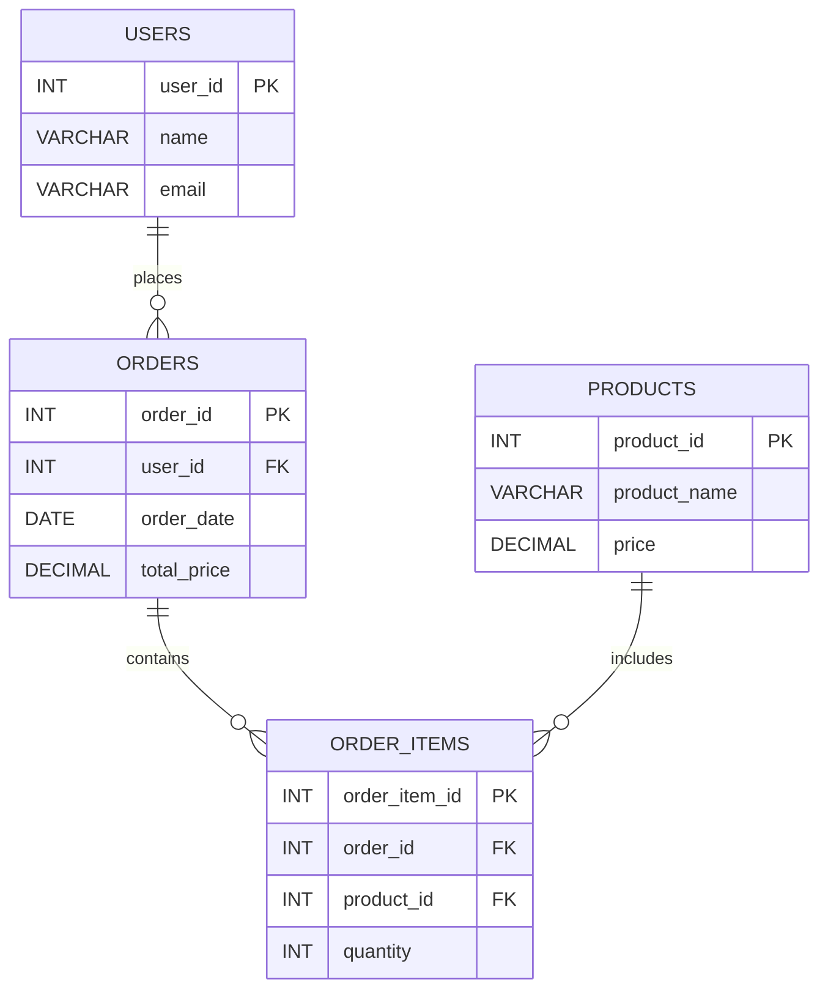

事前準備としてChatGPTに適当に生成してもらったテーブルとデータ(`11-0-generate.sql`)を作成する。。以下の図はテーブル同士の関係を図にしたものである。

2つのテーブルのデカルト積を取得したい場合、`CROSS JOIN`を用いる。すべての可能なバリエーションを列挙したい場合や、テストデータを生成したい場合などに使用される。以下のクエリではユーザーと商品名の組み合わせを取得している。
```
mysql> select users.name, products.product_name from users
    -> cross join products;
+---------+--------------+
| name    | product_name |
+---------+--------------+
| Jack    | Laptop       |
| Ivy     | Laptop       |
| Hank    | Laptop       |
| Grace   | Laptop       |
| Frank   | Laptop       |
| Eve     | Laptop       |
| David   | Laptop       |
| Charlie | Laptop       |
| Bob     | Laptop       |
| Alice   | Laptop       |
| Jack    | Smartphone   |
| Ivy     | Smartphone   |
| Hank    | Smartphone   |
| Grace   | Smartphone   |
| Frank   | Smartphone   |
| Eve     | Smartphone   |
| David   | Smartphone   |
| Charlie | Smartphone   |
| Bob     | Smartphone   |
| Alice   | Smartphone   |
| Jack    | Tablet       |
| Ivy     | Tablet       |
| Hank    | Tablet       |
| Grace   | Tablet       |
| Frank   | Tablet       |
| Eve     | Tablet       |
| David   | Tablet       |
| Charlie | Tablet       |
| Bob     | Tablet       |
| Alice   | Tablet       |
| Jack    | Headphones   |
| Ivy     | Headphones   |
| Hank    | Headphones   |
| Grace   | Headphones   |
| Frank   | Headphones   |
| Eve     | Headphones   |
| David   | Headphones   |
| Charlie | Headphones   |
| Bob     | Headphones   |
| Alice   | Headphones   |
| Jack    | Monitor      |
| Ivy     | Monitor      |
| Hank    | Monitor      |
| Grace   | Monitor      |
| Frank   | Monitor      |
| Eve     | Monitor      |
| David   | Monitor      |
| Charlie | Monitor      |
| Bob     | Monitor      |
| Alice   | Monitor      |
| Jack    | Keyboard     |
| Ivy     | Keyboard     |
| Hank    | Keyboard     |
| Grace   | Keyboard     |
| Frank   | Keyboard     |
| Eve     | Keyboard     |
| David   | Keyboard     |
| Charlie | Keyboard     |
| Bob     | Keyboard     |
| Alice   | Keyboard     |
| Jack    | Mouse        |
| Ivy     | Mouse        |
| Hank    | Mouse        |
| Grace   | Mouse        |
| Frank   | Mouse        |
| Eve     | Mouse        |
| David   | Mouse        |
| Charlie | Mouse        |
| Bob     | Mouse        |
| Alice   | Mouse        |
| Jack    | Webcam       |
| Ivy     | Webcam       |
| Hank    | Webcam       |
| Grace   | Webcam       |
| Frank   | Webcam       |
| Eve     | Webcam       |
| David   | Webcam       |
| Charlie | Webcam       |
| Bob     | Webcam       |
| Alice   | Webcam       |
| Jack    | Speaker      |
| Ivy     | Speaker      |
| Hank    | Speaker      |
| Grace   | Speaker      |
| Frank   | Speaker      |
| Eve     | Speaker      |
| David   | Speaker      |
| Charlie | Speaker      |
| Bob     | Speaker      |
| Alice   | Speaker      |
| Jack    | External SSD |
| Ivy     | External SSD |
| Hank    | External SSD |
| Grace   | External SSD |
| Frank   | External SSD |
| Eve     | External SSD |
| David   | External SSD |
| Charlie | External SSD |
| Bob     | External SSD |
| Alice   | External SSD |
+---------+--------------+
```