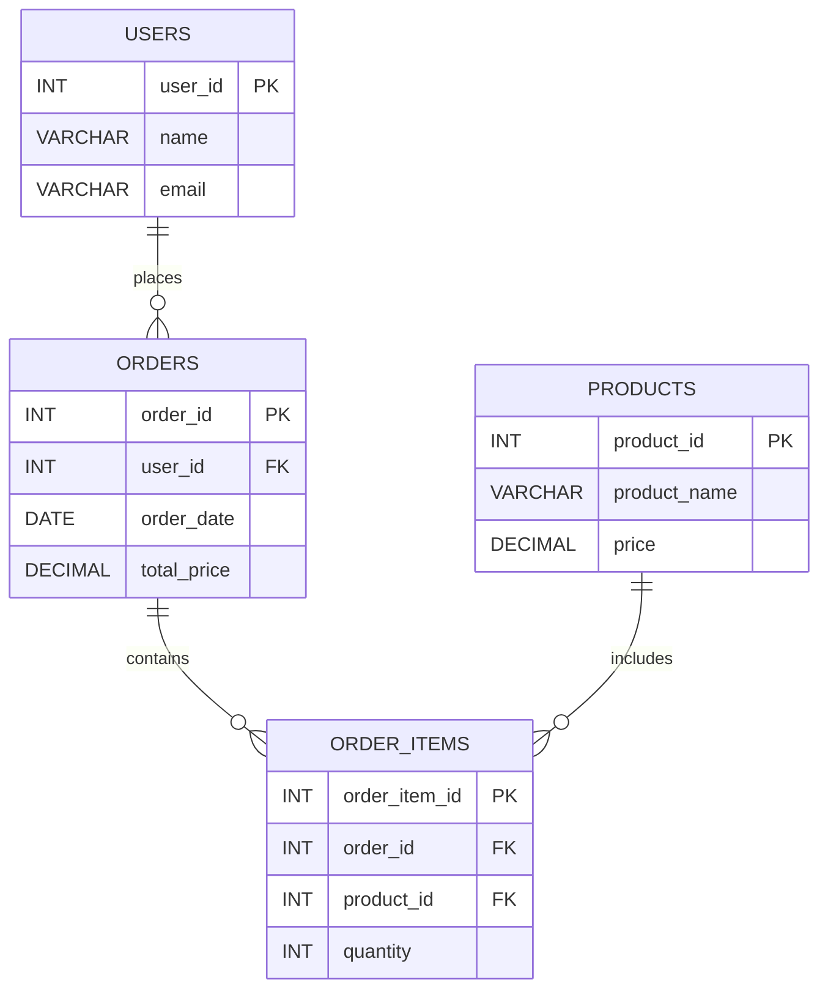

事前準備としてChatGPTに適当に生成してもらったテーブルとデータ(`11-0-generate.sql`)を作成する。ORDERSのtotal_priceに誤りがあったけれど内部結合には影響ないので修正は後回し(<置換予定>)。以下の図はテーブル同士の関係を図にしたものである。

特定のカラムの値に基づいて関連するデータを1つの結果のセットとして結合したい場合がある。例えば、顧客情報と注文情報が別々のテーブルに保存されているとする。どの顧客が何の注文をしたかを取得したい場合、これらのテーブルを結合させることで実現できる。2つ以上のテーブル間で共通するキーの値に基づいてレコードを結合する場合、`INNER JOIN 接続するテーブル名 ON 接続する条件`を用いる。以下のクエリでは注文したユーザーと注文情報を結合している。
```
mysql> select users.name, orders.order_id, orders.total_price
    -> from users
    -> inner join orders on users.user_id = orders.user_id;
+---------+----------+-------------+
| name    | order_id | total_price |
+---------+----------+-------------+
| Alice   |        1 |     1500.00 |
| Alice   |        4 |      800.00 |
| Bob     |        2 |      500.00 |
| Charlie |        3 |     1200.00 |
| Eve     |        5 |       80.00 |
| Frank   |        6 |      300.00 |
| Grace   |        7 |      250.00 |
| Hank    |        8 |      600.00 |
| Ivy     |        9 |      450.00 |
| Jack    |       10 |      750.00 |
+---------+----------+-------------+

-- 以下のように考える
-- テーブルの結合条件であるusers.user_id = orders.user_id = 1の場合を考える
-- users.user_id = 1のレコード
mysql> select name, user_id from users where user_id = 1;
+-------+---------+
| name  | user_id |
+-------+---------+
| Alice |       1 |
+-------+---------+

-- orders.user_id = 1のレコード
mysql> select user_id, order_id, total_price from orders where user_id = 1;
+---------+----------+-------------+
| user_id | order_id | total_price |
+---------+----------+-------------+
|       1 |        1 |     1500.00 |
|       1 |        4 |      800.00 |
+---------+----------+-------------+

-- 上2つのテーブルを結合する。今回はorder_id=1,4が条件を満たしているので、デカルト積のような形でレコードが結合される。
```
以下のクエリのように条件さえ満たしていれば現実的に意味がないような結合も行うことができる。
```
mysql> select users.name, users.user_id, orders.user_id, orders.order_id, orders.total_price
    -> from users
    -> inner join orders on (users.user_id > orders.user_id or users.user_id = orders.user_id);
+---------+---------+---------+----------+-------------+
| name    | user_id | user_id | order_id | total_price |
+---------+---------+---------+----------+-------------+
| Alice   |       1 |       1 |        1 |     1500.00 |
| Bob     |       2 |       1 |        1 |     1500.00 |
| Charlie |       3 |       1 |        1 |     1500.00 |
| David   |       4 |       1 |        1 |     1500.00 |
| Eve     |       5 |       1 |        1 |     1500.00 |
| Frank   |       6 |       1 |        1 |     1500.00 |
| Grace   |       7 |       1 |        1 |     1500.00 |
| Hank    |       8 |       1 |        1 |     1500.00 |
| Ivy     |       9 |       1 |        1 |     1500.00 |
| Jack    |      10 |       1 |        1 |     1500.00 |
| Bob     |       2 |       2 |        2 |      500.00 |
| Charlie |       3 |       2 |        2 |      500.00 |
| David   |       4 |       2 |        2 |      500.00 |
| Eve     |       5 |       2 |        2 |      500.00 |
| Frank   |       6 |       2 |        2 |      500.00 |
| Grace   |       7 |       2 |        2 |      500.00 |
| Hank    |       8 |       2 |        2 |      500.00 |
| Ivy     |       9 |       2 |        2 |      500.00 |
| Jack    |      10 |       2 |        2 |      500.00 |
| Charlie |       3 |       3 |        3 |     1200.00 |
| David   |       4 |       3 |        3 |     1200.00 |
| Eve     |       5 |       3 |        3 |     1200.00 |
| Frank   |       6 |       3 |        3 |     1200.00 |
| Grace   |       7 |       3 |        3 |     1200.00 |
| Hank    |       8 |       3 |        3 |     1200.00 |
| Ivy     |       9 |       3 |        3 |     1200.00 |
| Jack    |      10 |       3 |        3 |     1200.00 |
| Alice   |       1 |       1 |        4 |      800.00 |
| Bob     |       2 |       1 |        4 |      800.00 |
| Charlie |       3 |       1 |        4 |      800.00 |
| David   |       4 |       1 |        4 |      800.00 |
| Eve     |       5 |       1 |        4 |      800.00 |
| Frank   |       6 |       1 |        4 |      800.00 |
| Grace   |       7 |       1 |        4 |      800.00 |
| Hank    |       8 |       1 |        4 |      800.00 |
| Ivy     |       9 |       1 |        4 |      800.00 |
| Jack    |      10 |       1 |        4 |      800.00 |
| Eve     |       5 |       5 |        5 |       80.00 |
| Frank   |       6 |       5 |        5 |       80.00 |
| Grace   |       7 |       5 |        5 |       80.00 |
| Hank    |       8 |       5 |        5 |       80.00 |
| Ivy     |       9 |       5 |        5 |       80.00 |
| Jack    |      10 |       5 |        5 |       80.00 |
| Frank   |       6 |       6 |        6 |      300.00 |
| Grace   |       7 |       6 |        6 |      300.00 |
| Hank    |       8 |       6 |        6 |      300.00 |
| Ivy     |       9 |       6 |        6 |      300.00 |
| Jack    |      10 |       6 |        6 |      300.00 |
| Grace   |       7 |       7 |        7 |      250.00 |
| Hank    |       8 |       7 |        7 |      250.00 |
| Ivy     |       9 |       7 |        7 |      250.00 |
| Jack    |      10 |       7 |        7 |      250.00 |
| Hank    |       8 |       8 |        8 |      600.00 |
| Ivy     |       9 |       8 |        8 |      600.00 |
| Jack    |      10 |       8 |        8 |      600.00 |
| Ivy     |       9 |       9 |        9 |      450.00 |
| Jack    |      10 |       9 |        9 |      450.00 |
| Jack    |      10 |      10 |       10 |      750.00 |
+---------+---------+---------+----------+-------------+

mysql> select users.name, users.user_id, orders.order_id, orders.total_price
    -> from users
    -> inner join orders on users.user_id = orders.order_id;
+---------+---------+----------+-------------+
| name    | user_id | order_id | total_price |
+---------+---------+----------+-------------+
| Alice   |       1 |        1 |     1500.00 |
| Bob     |       2 |        2 |      500.00 |
| Charlie |       3 |        3 |     1200.00 |
| David   |       4 |        4 |      800.00 |
| Eve     |       5 |        5 |       80.00 |
| Frank   |       6 |        6 |      300.00 |
| Grace   |       7 |        7 |      250.00 |
| Hank    |       8 |        8 |      600.00 |
| Ivy     |       9 |        9 |      450.00 |
| Jack    |      10 |       10 |      750.00 |
+---------+---------+----------+-------------+
```
以下のクエリのように複数のjoinを用いてテーブルを結合することもできる。各ユーザーが購入した商品を取得している。
```
mysql> select
    ->     users.name as user_name,
    ->     products.product_name,
    ->     order_items.quantity
    -> from users
    -> inner join orders on users.user_id = orders.user_id
    -> inner join order_items on orders.order_id = order_items.order_id
    -> inner join products on order_items.product_id = products.product_id;
+-----------+--------------+----------+
| user_name | product_name | quantity |
+-----------+--------------+----------+
| Alice     | Laptop       |        1 |
| Alice     | Headphones   |        2 |
| Alice     | Monitor      |        2 |
| Bob       | Tablet       |        1 |
| Charlie   | Smartphone   |        1 |
| Eve       | Keyboard     |        1 |
| Eve       | Mouse        |        1 |
| Frank     | Webcam       |        1 |
| Frank     | Speaker      |        1 |
| Grace     | External SSD |        1 |
| Hank      | Laptop       |        1 |
| Hank      | Monitor      |        1 |
| Ivy       | Smartphone   |        1 |
| Ivy       | Tablet       |        2 |
| Jack      | Headphones   |        1 |
| Jack      | External SSD |        2 |
+-----------+--------------+----------+

-- Aliceが購入した商品に絞ると以下のテーブルを結合していったものになる。
mysql> select * from users where user_id = 1;
+---------+-------+-------------------+
| user_id | name  | email             |
+---------+-------+-------------------+
|       1 | Alice | alice@example.com |
+---------+-------+-------------------+
1 row in set (0.00 sec)

mysql> select * from orders where user_id = 1;
+----------+---------+------------+-------------+
| order_id | user_id | order_date | total_price |
+----------+---------+------------+-------------+
|        1 |       1 | 2024-02-01 |     1500.00 |
|        4 |       1 | 2024-02-04 |      800.00 |
+----------+---------+------------+-------------+
2 rows in set (0.00 sec)

mysql> select * from order_items where order_id in (1,4);
+---------------+----------+------------+----------+
| order_item_id | order_id | product_id | quantity |
+---------------+----------+------------+----------+
|             1 |        1 |          1 |        1 |
|             2 |        1 |          4 |        2 |
|             5 |        4 |          5 |        2 |
+---------------+----------+------------+----------+
3 rows in set (0.00 sec)

mysql> select * from products where product_id in (1,4,5);
+------------+--------------+---------+
| product_id | product_name | price   |
+------------+--------------+---------+
|          1 | Laptop       | 1200.00 |
|          4 | Headphones   |  150.00 |
|          5 | Monitor      |  300.00 |
+------------+--------------+---------+

-- *ですべてのカラムを取得できる。users.user_id = orders.user_id, orders.order_id = order_items.order_id, order_items.product_id = products.product_idが満たされていることがわかる。
mysql> select
    ->     *
    -> from users
    -> inner join orders on users.user_id = orders.user_id
    -> inner join order_items on orders.order_id = order_items.order_id
    -> inner join products on order_items.product_id = products.product_id;
+---------+---------+---------------------+----------+---------+------------+-------------+---------------+----------+------------+----------+------------+--------------+---------+
| user_id | name    | email               | order_id | user_id | order_date | total_price | order_item_id | order_id | product_id | quantity | product_id | product_name | price   |
+---------+---------+---------------------+----------+---------+------------+-------------+---------------+----------+------------+----------+------------+--------------+---------+
|       1 | Alice   | alice@example.com   |        1 |       1 | 2024-02-01 |     1500.00 |             1 |        1 |          1 |        1 |          1 | Laptop       | 1200.00 |
|       1 | Alice   | alice@example.com   |        1 |       1 | 2024-02-01 |     1500.00 |             2 |        1 |          4 |        2 |          4 | Headphones   |  150.00 |
|       1 | Alice   | alice@example.com   |        4 |       1 | 2024-02-04 |      800.00 |             5 |        4 |          5 |        2 |          5 | Monitor      |  300.00 |
|       2 | Bob     | bob@example.com     |        2 |       2 | 2024-02-02 |      500.00 |             3 |        2 |          3 |        1 |          3 | Tablet       |  500.00 |
|       3 | Charlie | charlie@example.com |        3 |       3 | 2024-02-03 |     1200.00 |             4 |        3 |          2 |        1 |          2 | Smartphone   |  800.00 |
|       5 | Eve     | eve@example.com     |        5 |       5 | 2024-02-05 |       80.00 |             6 |        5 |          6 |        1 |          6 | Keyboard     |   50.00 |
|       5 | Eve     | eve@example.com     |        5 |       5 | 2024-02-05 |       80.00 |             7 |        5 |          7 |        1 |          7 | Mouse        |   30.00 |
|       6 | Frank   | frank@example.com   |        6 |       6 | 2024-02-06 |      300.00 |             8 |        6 |          8 |        1 |          8 | Webcam       |   90.00 |
|       6 | Frank   | frank@example.com   |        6 |       6 | 2024-02-06 |      300.00 |             9 |        6 |          9 |        1 |          9 | Speaker      |  120.00 |
|       7 | Grace   | grace@example.com   |        7 |       7 | 2024-02-07 |      250.00 |            10 |        7 |         10 |        1 |         10 | External SSD |  200.00 |
|       8 | Hank    | hank@example.com    |        8 |       8 | 2024-02-08 |      600.00 |            11 |        8 |          1 |        1 |          1 | Laptop       | 1200.00 |
|       8 | Hank    | hank@example.com    |        8 |       8 | 2024-02-08 |      600.00 |            12 |        8 |          5 |        1 |          5 | Monitor      |  300.00 |
|       9 | Ivy     | ivy@example.com     |        9 |       9 | 2024-02-09 |      450.00 |            13 |        9 |          2 |        1 |          2 | Smartphone   |  800.00 |
|       9 | Ivy     | ivy@example.com     |        9 |       9 | 2024-02-09 |      450.00 |            14 |        9 |          3 |        2 |          3 | Tablet       |  500.00 |
|      10 | Jack    | jack@example.com    |       10 |      10 | 2024-02-10 |      750.00 |            15 |       10 |          4 |        1 |          4 | Headphones   |  150.00 |
|      10 | Jack    | jack@example.com    |       10 |      10 | 2024-02-10 |      750.00 |            16 |       10 |         10 |        2 |         10 | External SSD |  200.00 |
+---------+---------+---------------------+----------+---------+------------+-------------+---------------+----------+------------+----------+------------+--------------+---------+
```
結合したテーブルに対して`WHERE`を使用することができる。以下のクエリでは購入した商品数が2以上のものを取得している。
```
mysql> select
    ->     users.name as user_name,
    ->     products.product_name,
    ->     order_items.quantity
    -> from users
    -> inner join orders on users.user_id = orders.user_id
    -> inner join order_items on orders.order_id = order_items.order_id
    -> inner join products on order_items.product_id = products.product_id
    -> where order_items.quantity > 1;
+-----------+--------------+----------+
| user_name | product_name | quantity |
+-----------+--------------+----------+
| Ivy       | Tablet       |        2 |
| Alice     | Headphones   |        2 |
| Alice     | Monitor      |        2 |
| Jack      | External SSD |        2 |
+-----------+--------------+----------+
```

結合したテーブルに`GROUP BY`や`HAVING`を使用することもできる。以下のクエリでは各ユーザーの購入金額合計を計算し1000より大きいものを抜き出している。
```
mysql> select
    ->     users.name, sum(products.price) as "購入金額合計"
    -> from users
    -> inner join orders on users.user_id = orders.user_id
    -> inner join order_items on orders.order_id = order_items.order_id
    -> inner join products on order_items.product_id = products.product_id
    -> group by users.name
    -> having sum(products.price) > 1000;
+-------+--------------------+
| name  | 購入金額合計       |
+-------+--------------------+
| Alice |            1650.00 |
| Hank  |            1500.00 |
| Ivy   |            1300.00 |
+-------+--------------------+
```