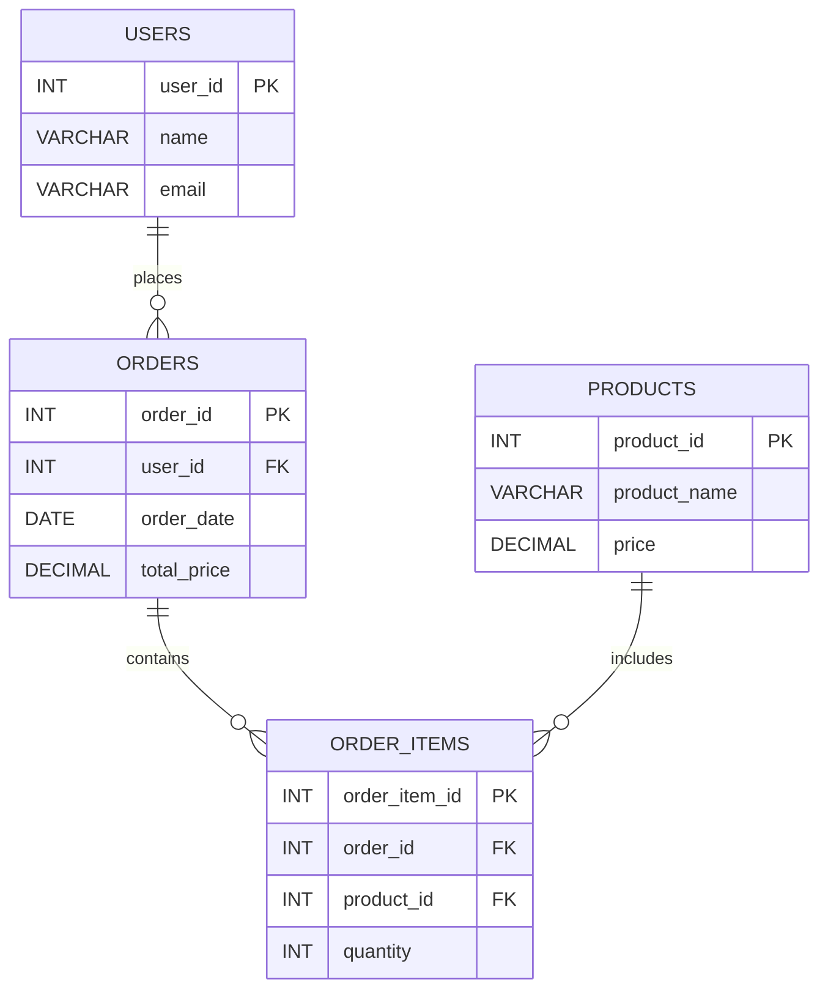

事前準備としてChatGPTに適当に生成してもらったテーブルとデータ(`11-0-generate.sql`)を作成する。以下の図はテーブル同士の関係を図にしたものである。

特定のカラムの値に基づいて関連するデータを1つの結果のセットとして結合したい場合がある。例えば、顧客情報と注文情報が別々のテーブルに保存されているとする。どの顧客が何の注文をしたかを取得したい場合、これらのテーブルを結合させることで実現できる。

```
```