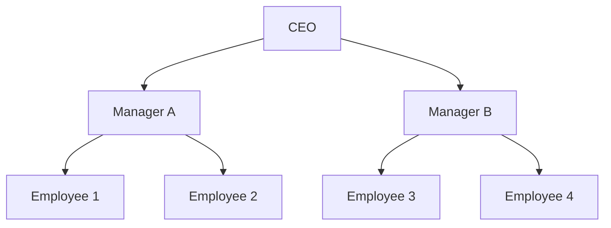

事前準備としてChatGPTに適当に生成してもらったテーブルとデータ(`12-0-generate.sql`)を作成する。サブクエリが何度もネストしていたりすると可読性が低くなり、読むのに時間がかかったり、思わぬバグが入り込むことがある。MySQL8.0以降では、共通テーブル式(Common Table Expressions(CTE))を利用することで、直感的で人間が読みやすいクエリを書くことができる。仮のテーブルを`WITH <仮のテーブル名> as <レコードを取得するクエリ>`で定義でき、後続の`SELECT`や別のCTEで利用できる。以下のクエリでは`WITH`の中身のクエリが取得するレコードが格納されているcustomer_totalsというテーブルが存在するように扱える。
```
mysql> with customer_totals as (
    ->     select customer_id, sum(amount) as total_spent
    ->     from orders
    ->     group by customer_id
    -> )
    -> select c.name, ct.total_spent
    -> from customers as c
    -> join customer_totals as ct on c.customer_id = ct.customer_id;
+---------------+-------------+
| name          | total_spent |
+---------------+-------------+
| Alice Johnson |      150.75 |
| Bob Smith     |      200.75 |
| Charlie Brown |      300.00 |
+---------------+-------------+

-- withの中身のクエリが取得するレコードは下記の通り。
mysql> select customer_id, sum(amount) as total_spent
    -> from orders
    -> group by customer_id;
+-------------+-------------+
| customer_id | total_spent |
+-------------+-------------+
|           1 |      150.75 |
|           2 |      200.75 |
|           3 |      300.00 |
+-------------+-------------+
```
CTEは再帰的なクエリを書くこともできるので、親子関係やツリー構造を表現することもできる。`WITH RECURSIVE`で仮のテーブルを定義し、初期条件と再帰パートを`UNION ALL`で繋げる。`UNION ALL`を使わない場合、すべての行を取得できなかったり余計な重複排除が入ったりして正しい結果が得られないことがあるので注意する。以下のクエリでは従業員がどの上司と部下を持っているかを取得している。
```
mysql> with recursive employee_hierarchy as (
    ->     select employee_id, name, manager_id, 1 as depth
    ->     from employees
    ->     where manager_id is null  -- 最上位のceoを取得
    ->
    ->     union all
    ->
    ->     select e.employee_id, e.name, e.manager_id, eh.depth + 1
    ->     from employees as e
    ->     join employee_hierarchy as eh on e.manager_id = eh.employee_id
    -> )
    -> select * from employee_hierarchy;
+-------------+------------+------------+-------+
| employee_id | name       | manager_id | depth |
+-------------+------------+------------+-------+
|           1 | CEO        |       NULL |     1 |
|           2 | Manager A  |          1 |     2 |
|           3 | Manager B  |          1 |     2 |
|           4 | Employee 1 |          2 |     3 |
|           5 | Employee 2 |          2 |     3 |
|           6 | Employee 3 |          3 |     3 |
|           7 | Employee 4 |          3 |     3 |
+-------------+------------+------------+-------+


-- 以下のように考える。
-- ルートノードを取得
mysql> select employee_id, name, manager_id, 1 as depth
    -> from employees
    -> where manager_id is null;  -- 最上位のceoを取得
+-------------+------+------------+-------+
| employee_id | name | manager_id | depth |
+-------------+------+------------+-------+
|           1 | CEO  |       NULL |     1 |
+-------------+------+------------+-------+

-- 上のemployee_idをmanager_idに持つレコードを取得
mysql> select e.employee_id, e.name, e.manager_id, 2 as depth
    -> from employees as e
    -> where e.manager_id = 1;
+-------------+-----------+------------+-------+
| employee_id | name      | manager_id | depth |
+-------------+-----------+------------+-------+
|           2 | Manager A |          1 |     2 |
|           3 | Manager B |          1 |     2 |
+-------------+-----------+------------+-------+

-- 上のemployee_idをmanager_idに持つレコードを取得
mysql> select e.employee_id, e.name, e.manager_id, 3 as depth
    -> from employees as e
    -> where e.manager_id in (2, 3);
+-------------+------------+------------+-------+
| employee_id | name       | manager_id | depth |
+-------------+------------+------------+-------+
|           4 | Employee 1 |          2 |     3 |
|           5 | Employee 2 |          2 |     3 |
|           6 | Employee 3 |          3 |     3 |
|           7 | Employee 4 |          3 |     3 |
+-------------+------------+------------+-------+

-- 上のemployee_idをmanager_idに持つレコードを取得(存在しない)
mysql> select e.employee_id, e.name, e.manager_id, 4 as depth
    -> from employees as e
    -> where e.manager_id in (4, 5, 6, 7);
Empty set (0.01 sec)
```
上記のテーブルを図にすると以下のようになる。
