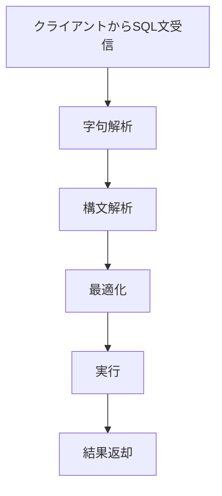

MySQLではSQL文を受け取るのように処理される。connectorはクライアント側からMySQLサーバーへSQL文を送信したり、結果を受け取ったりするためのクライアントライブラリであり、MySQLの内部実装ではないのでここでは割愛する。

##### 字句解析(Lexical Analysis)
受け取ったSQL文を文字列のトークンに分割する。

##### 構文解析(Parsing)
字句解析で得られたトークン列をもとに、SQL文が正しい構文であるかを確認する。

##### 最適化(Optimizer)
まず、構文解析で生成された抽象構文木に対して、どのテーブルやインデックスに対して、どのようにアクセスすれば効率的な実行になるかを判断する(クエリ最適化)。次に、テーブル結合の順序の決定、インデックスの利用判断、サブクエリの書き換えなどを行い、実行計画を作成する。最後にその他の様々な最適化を行う。

##### 実行(Executor)
最適化で作成された実行計画に基づき、ストレージエンジンからデータを取得するなどの処理が実行される。テーブルスキャンやインデックススキャン等が行われ、結果が一時領域に集められたりフィルタやソートを適用したりして、最終的な結果を生成する。

##### 結果返却
実行結果がMySQLサーバーからクライアントへ返される。